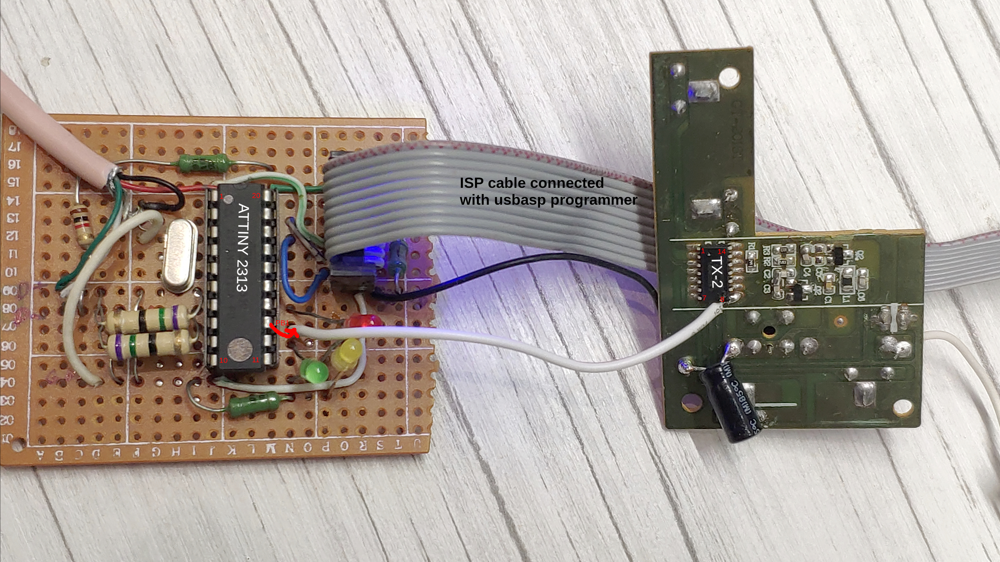

# RC project to control standart 27 mhz RC toys by PC using AVR USB device


## List of required hardware

* AVR attiny 2313
* 12 MHZ oscillator, 18-20 pF capacitors x 2, 68ohmz resistors x 2, 1.5kOhm resistor, 3.6V zenner diodes x 2, universal PCB board
* ISP programmer to upload firmware to AVR
* RC transmitter 27 mhz based on TX-2 chip
* 27 mhz RC toy


## Description

I was inspired by next russian post regarding reverse engineering protocol of 27mhz RC toys:

https://skootsone.yolasite.com/toy-rc1.php

Arduino sketch logic was rewritten for AVR attiny 2313 (I did use avr-gcc to compile it) to generate control pulses.
To prove the protocol is really working with RC toys the output pin of attiny was connected to the radio transmitter board.
In toy RC transmitter the TX-2 chip was used to code pressed keys into RC signals. TX-2 chip output pin is 8. 
So you can remove buttons and TX-2 chip or leave it and use your transmitter board as is by connecting the AVR output pin to the pin 8 of TX-2.
Do not forget to connect VCC+5V and GND to your transmitter board.




## Protocol
I did use Saleae Logic analyser to visualise protocol pulses from TX-2 chip.


E.g. on the foto you can see how code 10 (forward) is transmitted:
* 4 long pulses (header): each ~1.3ms high and ~0.5ms low signal with 75% duty cycle: ~1.8ms total.
* 10 short pulses: each 0.5ms low and 0.5ms low.

List of pulse sequences:
```
Forward: 10 pulses
Reverse: 40 pulses
Right: 64 pulses
Left: 58 pulses
Forward/Left: 28 pulses
Forward/Right: 34 pulses
Reverse/Left: 52 pulses
Reverse/Right: 46 pulses
```

Some other sources have another list of RC codes which is different from my devices:
```
Forward: 16 pulses
Reverse: 40 pulses
Forward/Left: 28 pulses
Forward/Right: 34 pulses
Reverse/Left: 52 pulses
Reverse/Right: 46 pulses
```

## Setup

You must make next changes in the next files if it differs from your setings:

firmware/main.c - output port and output bit on the port:
```
#define RC_PORT_OUTPUT     PORTB
#define RC_BIT             1
```
firmware/usbconfig.h - USB D-plus and D-minus bits on your AVR controller:
```
#define USB_CFG_DMINUS_BIT      3
#define USB_CFG_DPLUS_BIT       2
```


I did use Attiny 2313 microcontroller but do not see any reasons why another controller should not work.
The main requirement for VUSB library is 12mhz external oscillator support.

